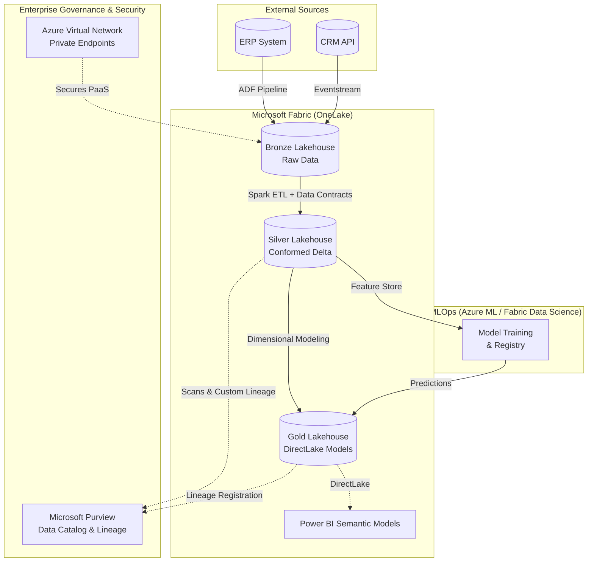

# Azure Data Intelligence Platform: Enterprise Fabric & Purview Data Mesh

[](https://learn.microsoft.com/en-us/azure/azure-resource-manager/bicep/)
[](https://learn.microsoft.com/en-us/microsoft-fabric/)
[](https://learn.microsoft.com/en-us/purview/)
[](https://greatexpectations.io/)

## Executive Summary
This repository contains an enterprise-grade reference architecture for a unified Data & AI platform on Azure. Evolving beyond a simple Lakehouse, it implements a **Comprehensive Data Mesh** utilizing **Microsoft Fabric** for unified compute and storage (OneLake), **Microsoft Purview** for decentralized data governance and lineage, and rigorous **Data Contracts** to ensure absolute data reliability across distributed domains.

## Architecture Overview

### Fabric-Native Medallion Architecture
We utilize a multi-layered approach strictly governed by Data Contracts to ensure data quality, reliability, and extreme performance via DirectLake.

1.  **Bronze (Raw/Ingestion):** Lands source data in its native format. Schema enforcement is minimal to allow for high-throughput ingestion.
2.  **Silver (Cleaned/Conformed):** Data is cleaned, standardized, and validated against explicit **Data Contracts** (via Great Expectations). Delta Lake is used for ACID transactions.
3.  **Gold (Curated/Business):** Highly aggregated, dimensional models optimized with V-Order for **Fabric DirectLake** mode, enabling sub-second Power BI semantics without data duplication.

### Enterprise Architecture Diagram (Mermaid)


## Core Enterprise Capabilities

### 🛡️ Data Contracts & Quality Framework
Data reliability is guaranteed through declarative Data Contracts implemented via **Great Expectations**. 
- **Shift-Left Quality:** Data is validated *before* being promoted to the Silver or Gold layers.
- **Automated Halts:** Pipelines are configured to fail securely upon contract breach, preventing downstream analytical corruption.
- Code Reference: `mlops/data_quality.py`

### 🌐 Enterprise Networking & Zero Trust
Security is paramount. Our IaC (Bicep) provisions a strict hub-and-spoke network topology.
- **Private Endpoints:** All PaaS services (Storage, KeyVault, Synapse) are accessed strictly over Microsoft backbone via Private Link. No public internet exposure.
- **NSG Control:** Micro-segmentation of compute workloads using rigorous Network Security Groups.
- Code Reference: `infrastructure/bicep/network.bicep`

### 🗺️ Decentralized Governance with Purview
Data democratization requires trust. We integrate deeply with Microsoft Purview.
- **Automated Scanning:** Built-in Fabric and Azure SQL scanners classify sensitive PII/PHI.
- **Custom Lineage API:** Complex Spark transformations push exact row/column lineage into the Atlas API, ensuring an unbroken audit trail from source system to dashboard.
- Code Reference: `infrastructure/governance/purview_lineage.py`

## Getting Started

### Prerequisites
- Azure Subscription (Owner or Contributor + User Access Administrator)
- Azure CLI & Bicep
- Python 3.9+
- Microsoft Fabric Capacity (or F-Trial)
- Microsoft Purview Account

### Deployment
1. Provision secure infrastructure (VNets, Private Endpoints, Storage):
   ```bash
   az deployment group create --resource-group rg-data-prod --template-file infrastructure/bicep/main.bicep
   ```
2. Install Python dependencies for data pipelines and governance scripts:
   ```bash
   pip install -r requirements.txt
   ```

## Repository Structure
- `pipelines/`: PySpark ETL logic for Medallion layers (e.g., `silver_to_gold.py` for Fabric DirectLake optimization).
- `infrastructure/`: Bicep templates for Enterprise Networking and IaC.
- `infrastructure/governance/`: Scripts for custom Purview Atlas API integration.
- `mlops/`: Data Quality frameworks (Great Expectations) and Azure DevOps CI/CD.
- `src/models/`: ML orchestration and training logic.
