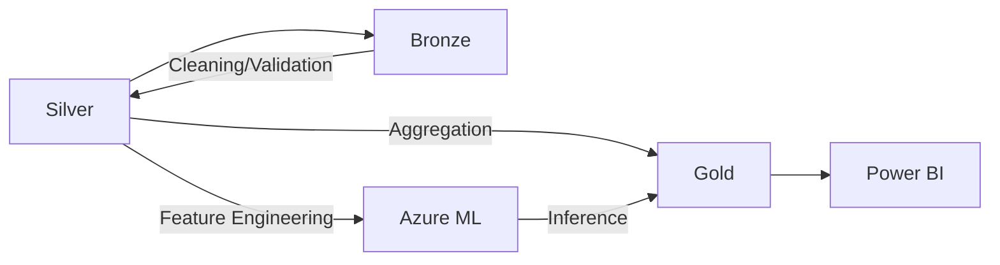

# Azure Data Intelligence Platform: Enterprise Medallion Architecture

[](https://learn.microsoft.com/en-us/azure/azure-resource-manager/bicep/)
[](https://learn.microsoft.com/en-us/microsoft-fabric/)
[](https://learn.microsoft.com/en-us/azure/machine-learning/)

## Executive Summary
This repository contains an enterprise-grade reference architecture for a unified Data & AI platform on Azure. Leveraging **Microsoft Fabric**, **Azure Synapse**, and **Azure Machine Learning**, it implements a robust Medallion Architecture (Bronze, Silver, Gold) with integrated MLOps lifecycles.

## Architecture Overview

### Medallion Architecture (Data Lakehouse)
We utilize a multi-layered approach to ensure data quality, reliability, and performance.

1.  **Bronze (Raw/Ingestion):** Lands source data in its native format. Schema enforcement is minimal to allow for high-throughput ingestion.
2.  **Silver (Cleaned/Conformed):** Data is cleaned, standardized, and validated against Pydantic models. Delta Lake is used for ACID transactions and time travel.
3.  **Gold (Curated/Business):** Highly aggregated, business-ready data optimized for reporting (Power BI) and advanced analytics.

### Conceptual Diagram (Mermaid)


## Microsoft Fabric Integration
This platform is designed to be **OneLake** native. By utilizing Fabric's shortcuts and unified capacity, we eliminate data silos and provide a seamless experience between Data Engineers and Data Scientists.

- **Synapse Data Engineering:** Spark notebooks for complex ETL.
- **Data Factory:** Pipeline orchestration for hybrid data movement.
- **Synapse Data Science:** ML Model training and experimentation with MLflow tracking.

## MLOps Lifecycle
Our MLOps strategy ensures that ML models are treated with the same rigor as traditional software.

- **CI/CD:** Automated testing and deployment via Azure DevOps.
- **Experiment Tracking:** MLflow integration for logging metrics, parameters, and artifacts.
- **Model Registry:** Centralized model management in Azure Machine Learning.
- **Monitoring:** Drift detection and performance monitoring using AML monitors.

## Getting Started

### Prerequisites
- Azure Subscription
- Azure CLI & Bicep
- Python 3.9+
- Microsoft Fabric Capacity (or F-Trial)

### Deployment
1. Provision infrastructure:
   ```bash
   az deployment group create --resource-group rg-prod --template-file infrastructure/bicep/main.bicep
   ```
2. Install dependencies:
   ```bash
   pip install -r requirements.txt
   ```

## Repository Structure
- `pipelines/`: PySpark ETL logic for Medallion layers.
- `src/models/`: ML orchestration and training logic.
- `infrastructure/`: Bicep templates for Infrastructure as Code (IaC).
- `mlops/`: Azure DevOps CI/CD definitions.
- `tests/`: Data quality and unit tests.
